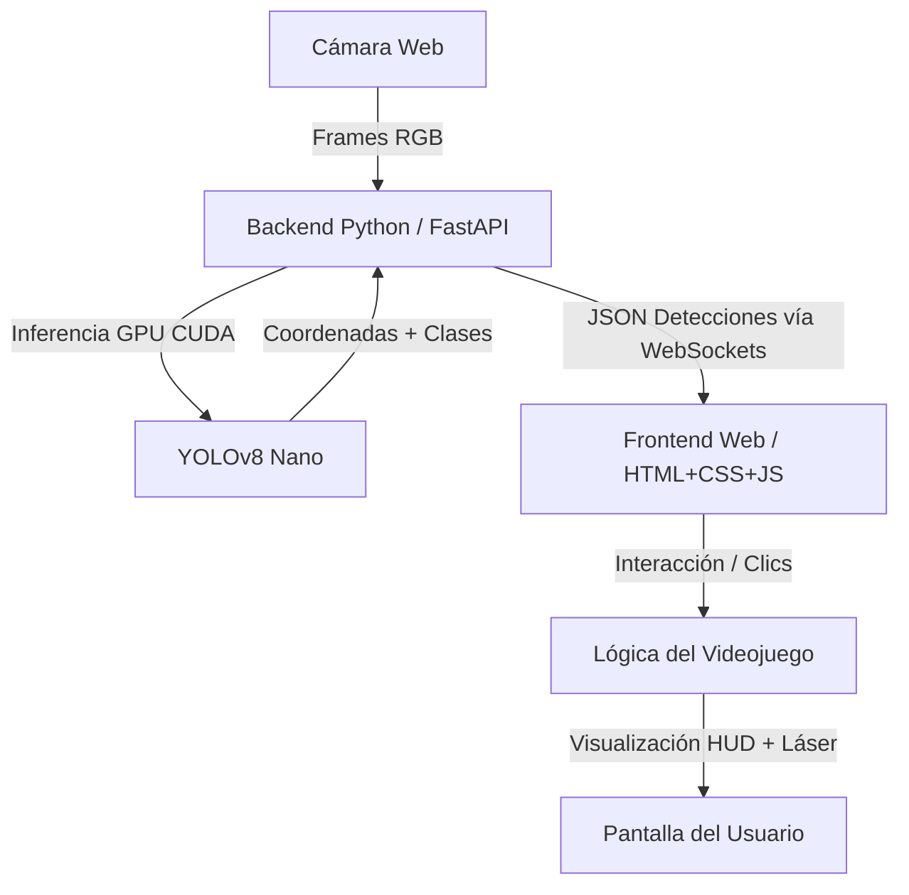

# Diseño Técnico: CropShield AI

## Objetivos técnicos
* **Latencia ultrabaja**: Visualización y detección a más de 30 FPS.
* **Procesamiento acelerado por GPU**: Uso de CUDA para ejecutar la inferencia de YOLOv8 en la GPU RTX 4070Ti (<5ms por frame).
* **Interactividad fluida**: Modos de interacción (Ratón y Auto-disparo) y efectos especiales en tiempo real.
* **Estética premium**: HUD tecnológico futurista consistente con los colores corporativos del INIA-CSIC.
* **Fácil instalación**: Configuración reproducible en Windows 11 utilizando `venv` y `uv`.

## Arquitectura
La aplicación sigue una arquitectura cliente-servidor desacoplada para separar el procesamiento pesado de imágenes de la interfaz de usuario.



## Componentes

### 1. Servidor Backend (Python)
* **API y Servidor WebSocket**: Implementado con **FastAPI** y **Uvicorn**. Gestiona la conexión en tiempo real con el navegador.
* **Captura de Vídeo**: Procesamiento del flujo de la webcam frame a frame mediante **OpenCV** en un hilo separado para evitar bloqueos.
* **Inferencia de IA**: Librería `ultralytics` para cargar y ejecutar **YOLOv8 Nano** (`yolov8n.pt` o modelo ajustado `best.pt`). Si CUDA está disponible, se transfiere automáticamente el modelo a la GPU.
* **Script de Entrenamiento/Ajuste**: Módulo independiente (`train.py`) para capturar fotos con la webcam, organizarlas en carpetas de entrenamiento/validación y realizar transfer learning con YOLOv8 sobre las clases `manzana` (cultivo) y `diente_de_leon` (amenaza).

### 2. Cliente Frontend (Web SPA)
* **HTML5 Canvas / DOM Overlays**: Renderizado del flujo de vídeo y superposición del HUD futurista (retículas, líneas de escaneo y cajas de detección).
* **Sistema de Estilos (CSS)**: Sistema basado en variables CSS con la paleta de colores del INIA-CSIC y efectos de brillo neón (box-shadow, text-shadow).
* **Motor del Juego (JavaScript)**:
  * Control del ciclo de juego (Game Loop) a 60 FPS mediante `requestAnimationFrame`.
  * Detección de colisiones (comprobar si el clic del ratón o la mira de auto-disparo coincide con el bounding box del diente de león).
  * Gestor de audio (Web Audio API) para efectos de sonido (láser, aciertos, errores).
  * Gestor de partículas para efectos visuales del rayo láser e impacto.

## Flujo de datos
1. El backend captura un frame de la cámara web.
2. Si el cliente está conectado por WebSocket, el backend redimensiona el frame a 640x480 (o mantiene la resolución nativa) y lo pasa por el modelo YOLOv8.
3. El backend codifica el frame en JPEG y lo convierte a Base64.
4. El backend envía al frontend un mensaje JSON por el WebSocket que contiene:
   * El frame de vídeo en Base64.
   * La lista de detecciones: `[{"box": [x1, y1, x2, y2], "class": "manzana/diente_de_leon", "confidence": 0.92}, ...]`
5. El frontend decodifica el frame, lo pinta en el canvas y superpone las retículas HUD correspondientes.
6. El frontend procesa las acciones del usuario (clics en pantalla o auto-disparo al centrar un objetivo).

## Modelo de datos
El flujo de datos por WebSocket utiliza el siguiente esquema JSON simplificado:

```json
{
  "image": "data:image/jpeg;base64,...",
  "detections": [
    {
      "box": [100, 150, 250, 300],
      "class": "manzana",
      "confidence": 0.94
    },
    {
      "box": [400, 200, 480, 280],
      "class": "diente_de_leon",
      "confidence": 0.89
    }
  ]
}
```

## Interfaces
* **Fondo HUD**: Oscuro profundo (`#0d0e12`).
* **Marcos y Textos**: Gris CSIC (`#A2AAAD`) y Blanco (`#ffffff`).
* **Láser y Alertas (Diente de León)**: Rojo CSIC (`#AF071F`) con brillo de alta intensidad.
* **Detección Segura (Manzanas)**: Verde neón digital (`#00ff88`).

## Dependencias
### Backend (Python):
* `fastapi`: API web y WebSockets.
* `uvicorn`: Servidor ASGI de alto rendimiento.
* `opencv-python`: Captura y manipulación de imágenes.
* `ultralytics`: Carga e inferencia de modelos YOLOv8.
* `torch`, `torchvision`, `torchaudio`: Librerías base para Deep Learning con soporte CUDA 11.8/12.1.

### Frontend (Javascript):
* No se requieren dependencias externas (servido directamente como archivos estáticos desde FastAPI).

## Seguridad
* **Ejecución Local**: No se transmiten datos fuera de la máquina local. La cámara web se procesa 100% en local.
* **Control de Procesos**: FastAPI se enlaza exclusivamente a `127.0.0.1` para evitar accesos no autorizados desde la red local.

## Estrategia de pruebas
* **Pruebas del Modelo**: Script de prueba `test_camera.py` para verificar que OpenCV lee la webcam a altos FPS y que PyTorch detecta la GPU RTX 4070Ti con CUDA habilitado.
* **Pruebas de Integración**: Pruebas de conexión por WebSocket y cálculo de FPS en el frontend.
* **Pruebas del Juego**: Verificación de la puntuación en ambos modos (Ratón y Auto-disparo).

## Estrategia de documentación
* `README.md`: Resumen general.
* `INSTALL.md`: Instrucciones paso a paso usando PowerShell y `uv`.
* `USER_GUIDE.md`: Guía para el expositor del showcase para calibrar y operar la demo.

## Despliegue
* Aplicación de ejecución local. El expositor ejecuta un script de inicio de PowerShell (`run.ps1`) que activa el entorno virtual y arranca el servidor. El navegador web se abre automáticamente.

## Reversión
* Si la inferencia GPU falla debido a controladores CUDA desactualizados, el sistema realiza automáticamente una degradación elegante (*graceful degradation*) a CPU (`device='cpu'`), notificando una advertencia en la consola pero permitiendo que el showcase funcione.

## Alternativas consideradas
1. **Modelos Web (TensorFlow.js / ONNX Runtime Web)**: Se descartó porque la GPU RTX 4070Ti del cliente ofrece una potencia muy superior a WebGL en navegador. Ejecutar YOLOv8 Nano localmente en Python por CUDA garantiza latencias de inferencia de 2-4ms, inalcanzables en navegadores convencionales con modelos de detección medianos/grandes.
2. **Streaming RTSP/WebRTC**: Se evaluó WebRTC por su baja latencia, pero la transmisión directa de frames JPEG comprimidos a través de WebSockets en localhost (`127.0.0.1`) demostró ser extremadamente sencilla de implementar, con una latencia de red imperceptible (<3ms) y una tasa de FPS estable de 35-40 FPS.
